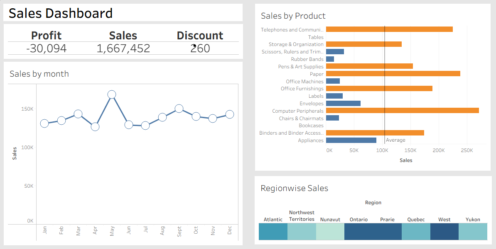

# Sales Dashboard Mini Project

## Project Overview
This mini project demonstrates how to build a **basic interactive dashboard** in **Tableau** using a cleaned sales dataset.  
The dashboard provides key insights such as sales trends, product performance, and regional distribution.

---

## Dataset
- **Source:** sales.xlsx - Orders.csv  
- **Contents:**  
  - Order details (Order ID, Product Name, Category)  
  - Sales amount  
  - Quantity sold  
  - Customer and regional data  
  - Order dates  

---

## Steps Followed
1. **Data Cleaning (Python - Jupyter Notebook)**
   - Removed duplicates and handled missing values.
   - Converted date columns to proper datetime format.
   - Saved cleaned dataset as `sales_cleaned.csv`.

2. **Dashboard Creation (Tableau)**
   - Imported the cleaned dataset into Tableau.
   - Created visualizations such as:
     - Sales over time.
     - Top-performing products.
     - Regional sales distribution.
   - Combined visualizations into a single dashboard.

---

## Dashboard Preview
> *(Insert Dashboard Image Here)*  

---

## How to Use
1. Open Tableau Desktop or Tableau Public.
2. Load the `sales_cleaned.csv` file.
3. Recreate or customize the dashboard using the provided visualizations.
4. Publish or export the dashboard as needed.

---

## Project Files
- `sales_cleaned.csv` – Cleaned dataset ready for visualization.
- `sales_dashboard.twbx` – Tableau workbook file (if shared).
- `dashboard_image.png` – Screenshot of final dashboard (to be added).
- `README.md` – Project documentation.

---

## Tools Used
- **Python (Pandas, NumPy)** – For data cleaning and preprocessing.
- **Tableau** – For building the dashboard.
- **Jupyter Notebook** – For data exploration and cleaning.

---

## Future Improvements
- Add advanced KPIs (e.g., profit margins, customer segments).
- Include predictive sales trends using machine learning.
- Enhance dashboard interactivity with filters and drill-downs.
